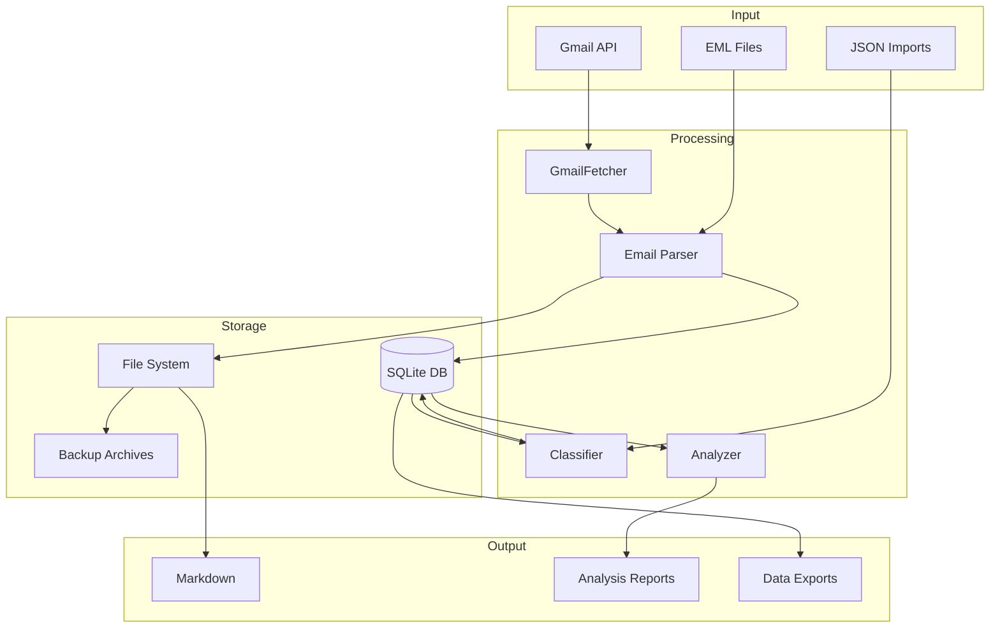

# Data Architecture Assessment Report

**Project**: Gmail Assistant
**Assessment Date**: 2026-01-09
**Assessment Type**: Comprehensive Data Architecture Review
**Version**: 1.0

---

## Executive Summary

The Gmail Assistant project demonstrates a well-structured data architecture with multiple storage patterns, transformation pipelines, and integration capabilities. This assessment identifies strengths, areas for improvement, and provides actionable recommendations for data architecture optimization.

### Overall Assessment Score: **B+ (Good with Enhancement Opportunities)**

| Category | Score | Notes |
|----------|-------|-------|
| Data Model Design | B | Good protocol definitions, needs formal schema enforcement |
| Storage Architecture | B+ | Multi-format support, good organization patterns |
| Data Flow Architecture | A- | Clear pipelines, good transformation layers |
| Integration Patterns | B+ | Strong protocol-based design, extensible |
| Data Governance | B | Timestamped naming, needs stronger validation |
| Scalability | B- | Current design works, needs optimization for scale |

---

## 1. Data Model Assessment

### 1.1 Current Data Structures

#### Email Metadata Schema (protocols.py)

```python
@dataclass
class EmailMetadata:
    id: str
    thread_id: str
    subject: str
    sender: str
    recipients: List[str]
    date: str
    labels: List[str]
    snippet: str = ""
    size_estimate: int = 0
```

**Strengths**:
- Uses Python dataclasses for immutable, type-safe structures
- Clear field naming conventions
- Default values for optional fields

**Issues Identified**:
- `date` field is a string - should be `datetime` for proper temporal queries
- No field validation (email format, max lengths)
- Missing fields: `cc`, `bcc`, `attachment_count`, `has_attachments`
- `recipients` should be structured (name, email pairs)

#### Newsletter Detection Schema (newsletter_cleaner.py)

```python
@dataclass
class EmailData:
    id: str
    subject: str
    sender: str
    date: str
    labels: List[str] = None
    thread_id: str = None
    body_snippet: str = ""
```

**Issues Identified**:
- Duplicate data structure - violates DRY principle
- Inconsistent with `EmailMetadata` schema
- `labels` default to `None` instead of empty list (mutable default anti-pattern)

### 1.2 Database Schema (database.py)

```sql
CREATE TABLE emails (
    id INTEGER PRIMARY KEY AUTOINCREMENT,
    filename TEXT NOT NULL,
    file_path TEXT NOT NULL,
    gmail_id TEXT,
    thread_id TEXT,
    date_received TEXT,
    parsed_date TEXT,
    year_month TEXT NOT NULL,
    sender TEXT,
    recipient TEXT,
    subject TEXT,
    labels TEXT,
    message_content TEXT,
    extraction_timestamp TEXT NOT NULL,
    import_timestamp TEXT NOT NULL DEFAULT CURRENT_TIMESTAMP,
    UNIQUE(file_path),
    CHECK(length(year_month) = 7)
);
```

**Strengths**:
- Good indexing strategy (year_month, gmail_id, sender, etc.)
- FTS5 full-text search implementation
- Import batch tracking
- WAL mode for concurrent access

**Issues Identified**:
- `recipient` is singular - should be a separate table for normalization
- `labels` stored as TEXT - should be normalized to separate table
- No foreign key to `import_batches` table
- Mixed date formats (`date_received` vs `parsed_date`)
- Missing `updated_at` for tracking modifications
- No soft delete support

### 1.3 Classification Schema (classifier.py)

The classifier adds these columns dynamically:

```python
classification_columns = [
    ('primary_category', 'TEXT'),
    ('domain_category', 'TEXT'),
    ('priority_level', 'TEXT'),
    ('source_type', 'TEXT'),
    ('action_required', 'TEXT'),
    ('confidence_score', 'REAL'),
    ('classification_rules', 'TEXT'),  # JSON
    ('classification_date', 'TEXT'),
    ('sender_frequency', 'INTEGER'),
    ('is_thread', 'BOOLEAN'),
    ('has_unsubscribe', 'BOOLEAN'),
    ('automated_score', 'REAL')
]
```

**Issues Identified**:
- Dynamic schema modification - fragile for production
- No enum validation for category values
- `classification_rules` as JSON in SQLite - denormalized

---

## 2. Storage Architecture Assessment

### 2.1 File-Based Storage Patterns

#### Current Directory Structure
```
gmail_backup/
├── YYYY/MM/                      # Date-based organization
│   ├── YYYY-MM-DD_HHMMSS_subject_messageid.eml
│   └── YYYY-MM-DD_HHMMSS_subject_messageid.md
├── sender_name/                  # Sender-based organization
│   └── ...
└── _clean/                       # Processed output
    └── YYYY/MM/
        ├── *.md
        └── _attachments/
```

**Strengths**:
- Flexible organization strategies (date, sender, none)
- Atomic file writes with temp file pattern
- Consistent filename format with timestamp and message ID
- Clean separation of raw (EML) and processed (MD) content

**Issues Identified**:
- No manifest file for directory contents
- Filename length can exceed filesystem limits (200 char truncation)
- No checksums for integrity verification
- Attachment handling inconsistent across modules
- No compression for large backup sets

### 2.2 Multi-Format Support

| Format | Purpose | Storage Location |
|--------|---------|------------------|
| EML | Raw email preservation | `gmail_backup/YYYY/MM/` |
| Markdown | Human-readable content | `gmail_backup/YYYY/MM/` |
| JSON | Monthly email data batches | `monthly_email_data/` |
| SQLite | Searchable database | `data/databases/` |
| Parquet | Analytics data | N/A (referenced but not implemented) |
| YAML | Front matter metadata | Embedded in MD files |

**Strengths**:
- Multi-format approach supports diverse use cases
- EML preserves original email structure
- Markdown with YAML front matter enables metadata queries

**Issues Identified**:
- No unified format for cross-system data exchange
- Parquet mentioned in analysis code but not implemented
- JSON schema not formally defined
- No format version tracking

### 2.3 Backup Architecture

#### Multi-Backup Management
- `move_backup_years.ps1` - Year-based folder merging
- `dedupe_merge.ps1` - Deduplication across backups

**Issues Identified**:
- No backup manifest with checksums
- No incremental backup tracking
- Deduplication is post-hoc rather than preventive
- No backup verification tools

---

## 3. Data Flow Architecture Assessment

### 3.1 Primary Data Flows

```
┌─────────────────────────────────────────────────────────────────┐
│                     Gmail API Data Flow                         │
├─────────────────────────────────────────────────────────────────┤
│                                                                 │
│  Gmail API ──► GmailFetcher ──► Message Processing ──► Output  │
│     │              │                    │                  │    │
│     │              ▼                    ▼                  ▼    │
│     │         Authentication       EML/Markdown         Files  │
│     │         (OAuth 2.0)          Generation           SQLite │
│     │                                                    JSON   │
│     ▼                                                          │
│  Rate Limiting ──► Pagination ──► Batch Processing             │
│                                                                 │
└─────────────────────────────────────────────────────────────────┘
```

```
┌─────────────────────────────────────────────────────────────────┐
│                  Content Transformation Flow                    │
├─────────────────────────────────────────────────────────────────┤
│                                                                 │
│  EML File ──► Email Parser ──► HTML Extraction ──► Markdown    │
│     │             │                   │                  │      │
│     ▼             ▼                   ▼                  ▼      │
│  Headers      MIME Parts         BeautifulSoup      Front Matter│
│  Body Text    Attachments        html2text          + Content   │
│  Metadata     CID Images         markdownify        + Metadata  │
│                                                                 │
└─────────────────────────────────────────────────────────────────┘
```

```
┌─────────────────────────────────────────────────────────────────┐
│                   Classification Flow                           │
├─────────────────────────────────────────────────────────────────┤
│                                                                 │
│  Email Data ──► Sender Analysis ──► Subject Analysis ──► Merge │
│      │              │                     │               │     │
│      ▼              ▼                     ▼               ▼     │
│  DB Query      Pattern Match        Pattern Match    Confidence │
│  Batch Load    Frequency Calc       Priority Detect  Scoring    │
│                Source Type          Thread Detect               │
│                                                                 │
│  ──► Content Analysis ──► Domain Classification ──► DB Update  │
│            │                      │                      │      │
│            ▼                      ▼                      ▼      │
│       Automation          Keyword Matching         Batch Write  │
│       Detection           Label Analysis           Index Update │
│       Unsubscribe                                               │
│                                                                 │
└─────────────────────────────────────────────────────────────────┘
```

**Strengths**:
- Clear separation of concerns in transformation layers
- Multi-strategy parsing with quality scoring
- Streaming support for memory-efficient processing
- Batch processing for database operations

**Issues Identified**:
- No formal pipeline orchestration
- Error recovery is per-message, not transactional
- No dead letter queue for failed messages
- Transformation state not tracked

### 3.2 Incremental Processing

```python
# From incremental.py
def get_latest_email_date(self) -> Optional[str]:
    # Query database for the latest email date
    cursor.execute("""
        SELECT parsed_date FROM emails
        WHERE parsed_date IS NOT NULL
        ORDER BY parsed_date DESC LIMIT 1
    """)
```

**Issues Identified**:
- Uses single column (`parsed_date`) for incremental sync
- No handling for Gmail API historyId for true incremental sync
- No watermark table for multiple sync sources
- Missing conflict resolution for re-processed emails

---

## 4. Configuration Schema Assessment

### 4.1 Configuration Files

| File | Purpose | Schema Validation |
|------|---------|-------------------|
| `config.schema.json` | Main config schema | JSON Schema 2020-12 |
| `config.json` | AI newsletter patterns | None |
| `gmail_assistant_config.json` | Fetcher settings | None |
| `analysis.json` | Analysis pipeline config | None |
| `organizer_config.json` | Email categorization | None |
| `deletion.json` | Deletion rules | None |

**Strengths**:
- JSON Schema defined for main configuration
- Comprehensive pattern definitions in configs
- Sensible defaults provided

**Issues Identified**:
- Only `config.schema.json` has formal schema
- No runtime validation for pattern configs
- Config files duplicated in `archive/` directory
- No environment-specific configuration support
- Missing configuration inheritance/override mechanism

### 4.2 Configuration Resolution (config.py)

```python
# Resolution Order:
# 1. CLI arguments
# 2. Environment variable: gmail_assistant_CONFIG
# 3. Project config: ./gmail-assistant.json
# 4. User config: ~/.gmail-assistant/config.json
# 5. Built-in defaults
```

**Strengths**:
- Clear resolution hierarchy
- Security-first defaults (credentials outside repo)
- Path expansion support (~)
- Strict key validation

**Issues Identified**:
- No config file watching for hot reload
- No encrypted configuration support
- No config versioning/migration

---

## 5. Data Governance Assessment

### 5.1 Naming Conventions

From CLAUDE.md:
```
Documentation: <mmdd-hhmm_name.extension>
Examples: 0922-0238_implementation_plan.md
```

**Strengths**:
- Timestamped naming prevents collisions
- Clear naming pattern documented
- Enforced through governance rules

**Issues Identified**:
- Timestamp format inconsistent (mmdd-hhmm vs YYYYMMDD)
- No auto-cleanup of old documentation
- No naming convention for data files

### 5.2 Data Quality Controls

From `analysis.json`:
```json
{
  "quality_thresholds": {
    "min_completeness": 95.0,
    "max_null_rate": 5.0,
    "max_duplicate_rate": 0.1,
    "min_date_coverage": 0.95,
    "min_classification_confidence": 0.8
  },
  "quality_gates": {
    "block_processing": [
      "duplicate_gmail_ids",
      "invalid_date_format",
      "critical_missing_data"
    ]
  }
}
```

**Strengths**:
- Configurable quality thresholds
- Multi-level quality gates (block/warning/info)
- Classification confidence tracking

**Issues Identified**:
- Quality checks only in analysis pipeline
- No quality metrics in fetch/storage layers
- No data lineage tracking
- No audit trail for modifications

---

## 6. Scalability Assessment

### 6.1 Current Capacity Estimates

| Metric | Current Design Capacity | Bottleneck |
|--------|------------------------|------------|
| Emails per session | ~50,000 | Gmail API quota |
| Database size | ~10GB practical | SQLite concurrency |
| File storage | Disk-limited | I/O throughput |
| Memory usage | ~8GB configurable | In-memory processing |

### 6.2 Scalability Concerns

1. **SQLite Limitations**
   - Single-writer constraint
   - No horizontal scaling
   - Large DB file management

2. **File System Constraints**
   - Directory listing performance with 100K+ files
   - No sharding strategy
   - Backup size grows linearly

3. **Memory-Bound Processing**
   - Content analysis loads emails into memory
   - No streaming for large email bodies

---

## 7. Recommendations

### 7.1 Critical Priority (Implement First)

#### R1: Unified Email Data Model
Create a single, canonical email data model used across all modules.

```python
# Proposed unified model
@dataclass(frozen=True)
class Email:
    """Canonical email representation."""
    # Identity
    gmail_id: str
    thread_id: str

    # Metadata
    subject: str
    sender: EmailAddress  # New structured type
    recipients: List[EmailAddress]
    cc: List[EmailAddress]
    bcc: List[EmailAddress]
    date: datetime  # Proper datetime type
    received_date: datetime

    # Content
    body_plain: Optional[str]
    body_html: Optional[str]
    snippet: str

    # Attachments
    attachments: List[Attachment]
    has_attachments: bool

    # Gmail-specific
    labels: List[str]
    size_bytes: int
    history_id: int  # For incremental sync

    # Derived
    is_read: bool
    is_starred: bool
    is_important: bool

@dataclass(frozen=True)
class EmailAddress:
    name: Optional[str]
    email: str
    domain: str  # Extracted for classification
```

**Location**: `src/gmail_assistant/core/models/email.py`

#### R2: Database Schema Normalization
Normalize the SQLite schema for better query performance and data integrity.

```sql
-- Proposed normalized schema
CREATE TABLE emails (
    id INTEGER PRIMARY KEY,
    gmail_id TEXT UNIQUE NOT NULL,
    thread_id TEXT NOT NULL,
    subject TEXT,
    body_plain TEXT,
    body_html TEXT,
    snippet TEXT,
    received_at DATETIME NOT NULL,
    size_bytes INTEGER,
    history_id INTEGER,
    is_read BOOLEAN DEFAULT FALSE,
    is_starred BOOLEAN DEFAULT FALSE,
    is_important BOOLEAN DEFAULT FALSE,
    created_at DATETIME DEFAULT CURRENT_TIMESTAMP,
    updated_at DATETIME DEFAULT CURRENT_TIMESTAMP,
    deleted_at DATETIME  -- Soft delete support
);

-- Normalized participants
CREATE TABLE email_participants (
    id INTEGER PRIMARY KEY,
    email_id INTEGER NOT NULL REFERENCES emails(id),
    participant_type TEXT CHECK(participant_type IN ('from', 'to', 'cc', 'bcc')),
    name TEXT,
    email_address TEXT NOT NULL,
    domain TEXT NOT NULL
);

-- Normalized labels
CREATE TABLE email_labels (
    email_id INTEGER NOT NULL REFERENCES emails(id),
    label TEXT NOT NULL,
    PRIMARY KEY (email_id, label)
);

-- Classification table (separate concerns)
CREATE TABLE email_classifications (
    email_id INTEGER PRIMARY KEY REFERENCES emails(id),
    primary_category TEXT,
    domain_category TEXT,
    priority_level TEXT,
    source_type TEXT,
    action_required TEXT,
    confidence_score REAL,
    automated_score REAL,
    classified_at DATETIME DEFAULT CURRENT_TIMESTAMP,
    classification_version INTEGER DEFAULT 1
);

-- Sync state tracking
CREATE TABLE sync_state (
    id INTEGER PRIMARY KEY,
    source TEXT NOT NULL,
    last_history_id INTEGER,
    last_sync_at DATETIME,
    emails_synced INTEGER DEFAULT 0,
    status TEXT
);
```

**Location**: `src/gmail_assistant/core/database/schema.sql`

#### R3: Configuration Schema Validation
Add JSON Schema validation for all configuration files.

```json
// config/schema/analysis.schema.json
{
  "$schema": "https://json-schema.org/draft/2020-12/schema",
  "$id": "analysis.schema.json",
  "title": "Analysis Configuration",
  "type": "object",
  "required": ["quality_thresholds", "classification_config"],
  "properties": {
    "quality_thresholds": {
      "type": "object",
      "properties": {
        "min_completeness": {"type": "number", "minimum": 0, "maximum": 100},
        "max_null_rate": {"type": "number", "minimum": 0, "maximum": 100}
      }
    }
  }
}
```

### 7.2 High Priority (Implement Soon)

#### R4: Implement Data Lineage Tracking
Track data transformations for auditability.

```python
@dataclass
class DataLineage:
    source_id: str
    source_type: str  # 'gmail_api', 'eml_file', 'json_import'
    transformations: List[str]
    created_at: datetime
    checksum: str
```

#### R5: Add Manifest Files for Backups
Create manifest files for each backup directory.

```json
// backup_manifest.json
{
  "manifest_version": "1.0",
  "created_at": "2026-01-09T19:15:00Z",
  "backup_id": "uuid",
  "email_count": 1500,
  "date_range": {
    "start": "2025-01-01",
    "end": "2025-12-31"
  },
  "files": [
    {
      "path": "2025/01/email.eml",
      "gmail_id": "abc123",
      "sha256": "..."
    }
  ]
}
```

#### R6: Implement True Incremental Sync
Use Gmail API historyId for efficient incremental synchronization.

```python
def sync_incremental(self, history_id: Optional[int] = None) -> SyncResult:
    """Sync using Gmail history API for efficiency."""
    if history_id is None:
        history_id = self.get_last_sync_history_id()

    history = self.service.users().history().list(
        userId='me',
        startHistoryId=history_id,
        historyTypes=['messageAdded', 'messageDeleted', 'labelAdded', 'labelRemoved']
    ).execute()

    # Process changes incrementally
    for change in history.get('history', []):
        self.process_history_change(change)
```

### 7.3 Medium Priority (Plan for Future)

#### R7: Add Data Compression for Large Backups
Implement optional compression for backup storage.

```python
class CompressedBackupWriter:
    def __init__(self, compression='gzip', level=6):
        self.compression = compression
        self.level = level

    def write_batch(self, emails: List[Email], output_path: Path):
        # Write to compressed archive with manifest
        pass
```

#### R8: Implement Connection Pooling for SQLite
For better concurrency support with multiple read operations.

```python
from sqlalchemy import create_engine
from sqlalchemy.pool import QueuePool

engine = create_engine(
    'sqlite:///emails.db',
    poolclass=QueuePool,
    pool_size=5,
    max_overflow=10,
    pool_pre_ping=True
)
```

#### R9: Add Data Quality Metrics Dashboard
Implement quality metrics collection across all pipelines.

```python
class DataQualityMetrics:
    def __init__(self):
        self.metrics = {
            'completeness': {},
            'accuracy': {},
            'consistency': {},
            'timeliness': {}
        }

    def record_fetch_quality(self, batch_id: str, metrics: dict):
        pass

    def record_transformation_quality(self, batch_id: str, metrics: dict):
        pass
```

### 7.4 Low Priority (Future Enhancements)

#### R10: Consider PostgreSQL Migration Path
For enterprise scalability, design for potential PostgreSQL migration.

#### R11: Add Parquet Export for Analytics
Implement the referenced but unimplemented Parquet export.

#### R12: GraphQL API for Email Queries
Design a GraphQL schema for complex email queries.

---

## 8. Implementation Roadmap

### Phase 1: Foundation (Weeks 1-2)
- [ ] Implement unified Email data model (R1)
- [ ] Create database schema migration scripts (R2)
- [ ] Add configuration schema validation (R3)

### Phase 2: Data Quality (Weeks 3-4)
- [ ] Implement data lineage tracking (R4)
- [ ] Add backup manifest files (R5)
- [ ] Create quality metrics collection (R9)

### Phase 3: Scalability (Weeks 5-6)
- [ ] Implement true incremental sync (R6)
- [ ] Add compression support (R7)
- [ ] Implement connection pooling (R8)

### Phase 4: Future-Proofing (Weeks 7-8)
- [ ] Design PostgreSQL migration path (R10)
- [ ] Implement Parquet export (R11)
- [ ] Plan GraphQL API (R12)

---

## 9. Appendix

### A. Current File Inventory

| Path | Purpose | Data Type |
|------|---------|-----------|
| `src/gmail_assistant/core/protocols.py` | Protocol definitions | Python |
| `src/gmail_assistant/core/processing/database.py` | SQLite operations | Python |
| `src/gmail_assistant/core/fetch/gmail_assistant.py` | Gmail API integration | Python |
| `src/gmail_assistant/parsers/gmail_eml_to_markdown_cleaner.py` | EML transformation | Python |
| `src/gmail_assistant/core/processing/classifier.py` | Email classification | Python |
| `src/gmail_assistant/analysis/email_analyzer.py` | Analytics engine | Python |
| `src/gmail_assistant/core/ai/newsletter_cleaner.py` | Newsletter detection | Python |
| `src/gmail_assistant/core/fetch/incremental.py` | Incremental fetch | Python |
| `config/config.json` | AI patterns config | JSON |
| `config/gmail_assistant_config.json` | Fetcher config | JSON |
| `config/analysis.json` | Analysis pipeline config | JSON |
| `config/schema/config.schema.json` | Main config schema | JSON Schema |

### B. Data Flow Diagram (Mermaid)



### C. Glossary

| Term | Definition |
|------|------------|
| EML | Email file format preserving original email structure |
| FTS5 | SQLite Full-Text Search extension |
| WAL | Write-Ahead Logging mode for SQLite |
| historyId | Gmail API incremental sync identifier |
| CID | Content-ID for inline email images |

---

**Report Generated**: 2026-01-09T19:15:00Z
**Analyst**: Data Architecture Designer (Claude Opus 4.5)
**Review Status**: Initial Assessment
